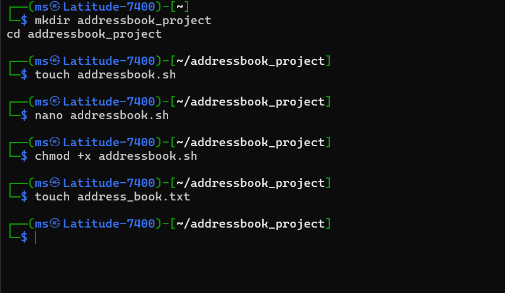
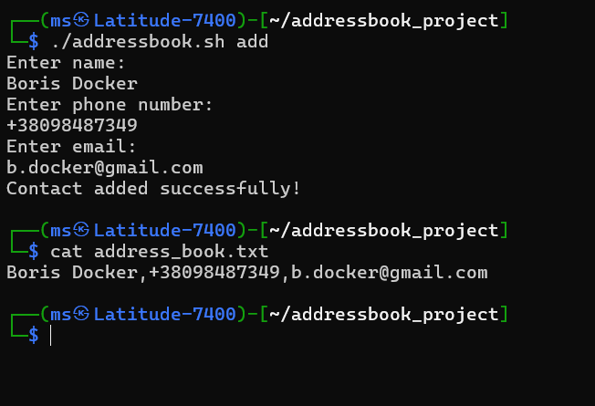
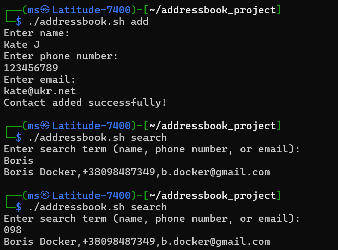
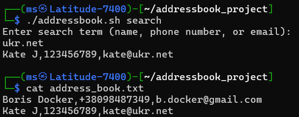
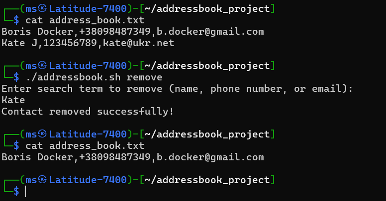

# Address Book Program in Bash

This is a simple address book program written in Bash. It allows you to add, search, and remove contacts using the terminal.

## Features
- Add a new contact with a name, phone number, and email.
- Search for contacts by name, phone number, or email.
- Remove contacts by name, phone number, or email.

## Usage

### 1. Adding a Contact
To add a contact, run the following command:

```bash
./addressbook.sh add
```

### 2. Searching for a Contact
To search for a contact, use:

```bash
./addressbook.sh search
```

### 3. Removing a Contact
To remove a contact, use:

```bash
./addressbook.sh remove
```

### 4. Viewing the Address Book
You can check the contents of the address book file by running:

```bash
cat address_book.txt
```

## Proof of Working Code

Below are images showing the code working correctly:

1. **01.png** - Creating files
2. **02.png** - Adding the contacts
3. **03.png** - Searching for a contact by name or number
4. **04.png** - Searching for a contact by email
5. **05.png** - Removing a contact & viewing the updated address book

## Images






